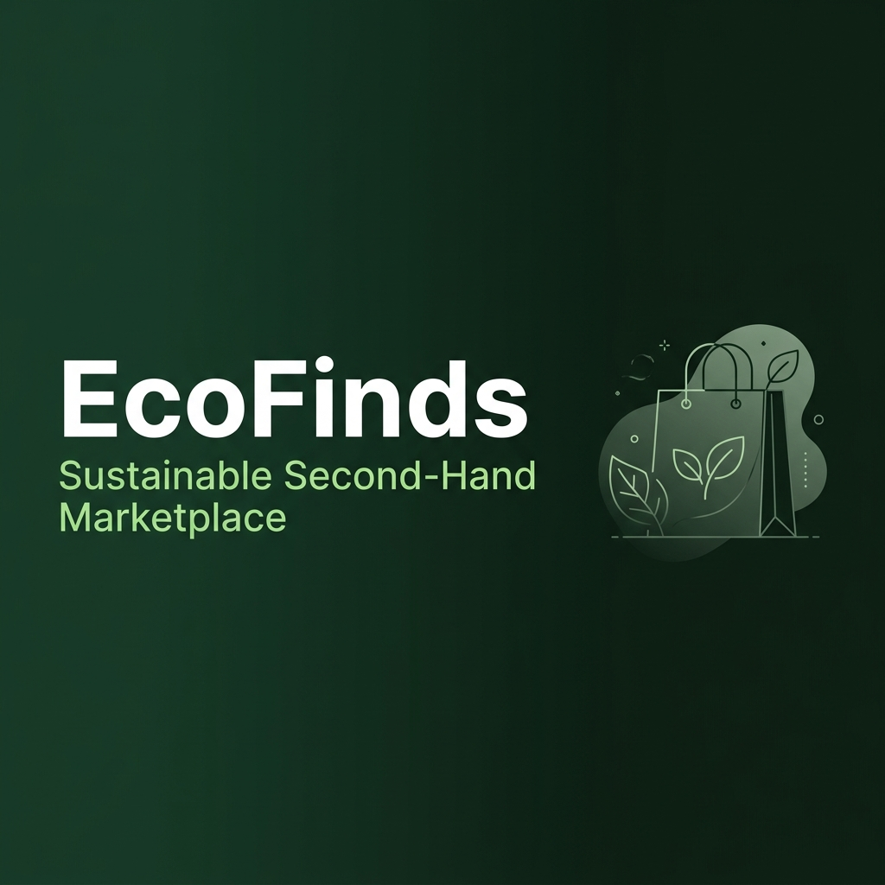

<div align="center">
  
</div>

<div align="center">

[](https://github.com/Manvikamboz/ECOFINDS-BASIC-ECOMMERCE-WEBSITE/actions/workflows/deploy.yml)


**Discover unique treasures, reduce waste, and embrace sustainable living.**
**Every purchase makes a difference for our planet.**

[View Live](https://ecofinds-basic-ecommerce-website.vercel.app) · [Watch Demo](./ecofinds_prototype.mp4) · [Report Bug](https://github.com/Manvikamboz/ECOFINDS-BASIC-ECOMMERCE-WEBSITE/issues)

</div>

---


## Features

| Feature | Description |
|---------|-------------|
| Authentication | JWT-based login/register with bcrypt password hashing (12 rounds) |
| Product Listings | Create, edit, delete listings with image upload (5MB max) |
| Search & Filter | Real-time search + filter by category with pagination |
| Shopping Cart | Add/remove items, quantity management, cart persistence |
| Checkout | Transactional checkout with full order history |
| Dashboard | Manage your listings, profile, and purchase history |
| Image Uploads | Upload product images with MIME type validation |

---

## Security Highlights


Security score: **98% — Grade A** (verified by built-in `security-scan.js`)

- Helmet.js — HTTP security headers (CSP, X-Frame-Options, HSTS)
- Rate Limiting — 10 req/15min on auth, 100 req/min globally
- CORS — restricted to allowed origin only
- bcrypt — salt rounds: 12, timing-safe login comparison
- Parameterized SQL — full protection against SQL injection
- XSS Prevention — `escapeHtml()` applied across all 25 DOM insertions
- Input Validation — server-side validation on every route
- DB Transactions — atomic checkout with rollback on failure
- JWT Secrets — loaded from env only, no hardcoded fallbacks
- Seller Protection — sellers cannot buy their own products
- File Safety — MIME type validation + 5MB size limit

```bash
node security-scan.js
# => 40 PASS | 1 WARN | 0 FAIL | Score: 98%
```

---

## Tech Stack


| Layer | Technology |
|-------|-----------|
| Backend | Node.js, Express.js 5.x |
| Database | MySQL (Aiven Cloud) via `mysql2` connection pool |
| Auth | JSON Web Tokens (JWT) + bcrypt |
| File Uploads | Multer (disk storage) |
| Security | Helmet, express-rate-limit, CORS |
| Frontend | HTML5, CSS3, Vanilla JavaScript |
| Deployment | Vercel (serverless) |
| CI/CD | GitHub Actions |

---

## Project Structure

```
ECOFINDS-BASIC-ECOMMERCE-WEBSITE/
├── .github/
│   └── workflows/
│       └── deploy.yml       # CI/CD: test + Vercel deploy
├── public/
│   ├── index.html           # Full frontend SPA
│   ├── banner.png           # README banner
│   └── uploads/             # Uploaded product images
├── server.js                # Express API server
├── schema.sql               # MySQL database schema
├── setup-db.js              # One-time DB initialisation script
├── security-scan.js         # Built-in security audit tool
├── vercel.json              # Vercel deployment config
├── package.json
└── .env                     # Local env vars (never committed)
```

---

## Local Development


### Prerequisites
- Node.js 18+
- MySQL (local or cloud)

### 1. Clone the repo
```bash
git clone https://github.com/Manvikamboz/ECOFINDS-BASIC-ECOMMERCE-WEBSITE.git
cd ECOFINDS-BASIC-ECOMMERCE-WEBSITE
```

### 2. Install dependencies
```bash
npm install
```

### 3. Create `.env` file
```env
DB_HOST=localhost
DB_PORT=3306
DB_USER=root
DB_PASSWORD=your_password
DB_NAME=ecofinds
DB_SSL=false
JWT_SECRET=your_super_secret_jwt_key_min_32_chars
PORT=3000
ALLOWED_ORIGIN=http://localhost:3000
```

### 4. Initialise the database
```bash
node setup-db.js
```

### 5. Start the dev server
```bash
npm run dev     # with auto-reload via nodemon
npm start       # production mode
```

Visit: **http://localhost:3000**

---

## Production Deployment (Vercel + Aiven)

### Database — Aiven Cloud MySQL (Free Tier)
1. Sign up at [aiven.io](https://aiven.io) → create a MySQL service
2. Copy connection credentials
3. Run: `node setup-db.js`

### Deploy to Vercel
1. Go to [vercel.com/new](https://vercel.com/new)
2. Import this GitHub repo
3. Add environment variables:

| Variable | Value |
|----------|-------|
| `DB_HOST` | Aiven MySQL host |
| `DB_PORT` | `28156` (or your port) |
| `DB_USER` | `avnadmin` |
| `DB_PASSWORD` | Your Aiven password |
| `DB_NAME` | `defaultdb` |
| `DB_SSL` | `true` |
| `JWT_SECRET` | A strong random secret |
| `ALLOWED_ORIGIN` | Your Vercel URL |

4. Click **Deploy**

---

## CI/CD Pipeline

Every push to `main` automatically:

```
Push to main
     |
     v
[Build & Test] -- Node 18.x + 20.x matrix
     |               npm ci + npm test
     |
     v
[Deploy] --------- npx vercel --prod
                   (via VERCEL_TOKEN secret)
```

---

## API Reference

| Method | Endpoint | Auth | Description |
|--------|----------|------|-------------|
| POST | `/api/register` | No | Register new user |
| POST | `/api/login` | No | Login, returns JWT |
| GET | `/api/products` | No | List products (paginated) |
| GET | `/api/products/:id` | No | Get single product |
| POST | `/api/products` | Yes | Create listing |
| PUT | `/api/products/:id` | Yes | Update listing |
| DELETE | `/api/products/:id` | Yes | Delete listing |
| GET | `/api/cart` | Yes | Get cart items |
| POST | `/api/cart` | Yes | Add to cart |
| DELETE | `/api/cart/:id` | Yes | Remove from cart |
| POST | `/api/checkout` | Yes | Place order |
| GET | `/api/orders` | Yes | Purchase history |
| GET | `/api/my-products` | Yes | My listings |
| PUT | `/api/profile` | Yes | Update profile |

---

## Contributing

1. Fork the repo
2. Create a feature branch: `git checkout -b feature/your-feature`
3. Commit: `git commit -m 'feat: add your feature'`
4. Push: `git push origin feature/your-feature`
5. Open a Pull Request

---

<div align="center">


**Built by Manvi Kamboj** — built with vibe coding

*EcoFinds — Every purchase makes a difference*

</div>
